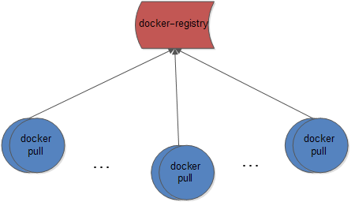

registry-pressure-measurement-tools
====================

registry-pressure-measurement-tools is a tool that measures the performance of docker registry.

## Architecture

## PULL_TIME(CONCURRENCY)

    
## Refs

* [migrator](https://docs.openstack.org/developer/performance-docs/test_results/container_repositories/registry2/index.html)
