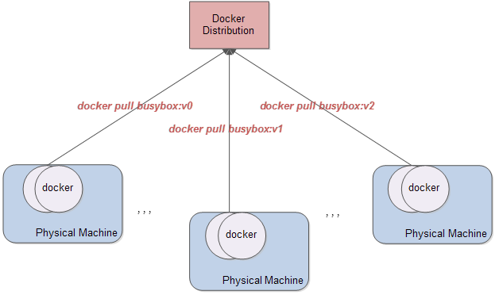
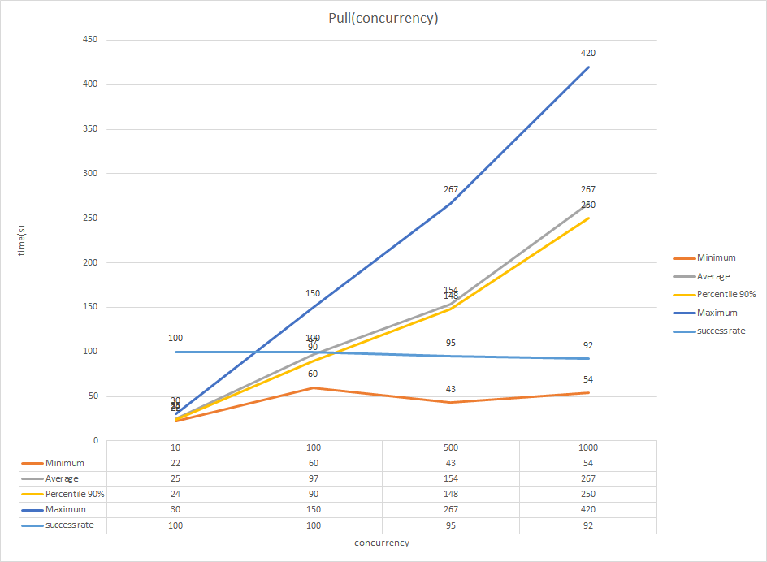

registry-pressure-measurement-tools
====================

registry-pressure-measurement-tools is a tool that measures the performance of docker registry by using only several few machines.

## Introduction

Normally, we perform pressure-measurement of docker registry by executing `docker pull` on a great number of machines, which is effective and convenient but it will be unuseful when there are no enough machines, and in this more common situation, `registry-pressure-measurement-tools` put to use.

`registry-pressure-measurement-tools` is based on [openstack test_plans](https://docs.openstack.org/developer/performance-docs/test_results/container_repositories/registry2/index.html) and uses only several few machines to achieve a similar effect as above.

## Architecture



## Test Plan

* 1.Build enough images that will be pulled repeatedly by docker.

* 2.Upload these images to the docker repository with `test-repo-formal.py`.

  ```bash
  date > file;python test-repo-formal.py >> file;date >> file
  ```

* 3.Delete created images from a local docker on a machine with test tool where docker images was created. After this step created images should be placed in the docker repository and they should be removed from the local docker.

  ```bash
  bash clear.sh
  ```

* 4.Run `docker pull` in the cycle with concurrency value. You need to perform by one cycle per each CONCURRENCY value from the following list:

  * CONCURRENCY=1
  * CONCURRENCY=100
  * CONCURRENCY=500
  * CONCURRENCY=1000

  ```bash
  date > file;python test-repo-formal.py >> file;date >> file
  ```

  As a result of the previous step you should be able to provide the amount of graphs and tables with the dependences on an iteration number of a response time. One graph and one table per each CONCURRENCY. On this step you need to calculate success rate, minima, maxima, average and 90% percental of PULL_TIME parameter per each CONCURRENCY value:

  ```bash
  bash time_cal.sh
  
  ```

  

## Attention

* 1.You need to delete all images after each CONCURRENCY

  ```bash
  bash clear.sh
  ```

* 2.You nedd to build images that will be pulled repeatedly by docker(and again, this is a necessary condition).

* 3.You should run `docker pull` on different machines to split the load of resources and network flow.

## Refs

* [openstack test plans](https://docs.openstack.org/developer/performance-docs/test_results/container_repositories/registry2/index.html)
